# Machine Learning Crysis prediction

## Introduction

This project leverages a dataset spanning 1870 to 2014, focusing on 13 African countries' financial variables. By employing machine learning techniques, I aim to develop a robust model that **predicts the occurrence of financial crises**. By identifying historical patterns and key indicators, this study contributes to effective policies and interventions, fostering economic stability and sustainable development across the African continent.

### **Independent Variables**

* The **year** of the observation
* The **exchange rate** of the country vis-a-vis the USD
* Whether **domestic debt** default occurred in the year
* Whether **sovereign external debt** default occurred in the year
* The total country's **debt**
* The annual **CPI Inflation** rate
* Whether the country is considered **independent**
* Whether **currency crisis** occurred in the year
* Whether **inflation crisis** occurred in the year

### Dependent Variables

* Whether a **systemic crisis** occurred in the year

*Since systemic crisis is the outcome that I am predicting*

## Methods

First of all, I have randomly split the entire dataset into two - one for training and the other one for testing.

I used both regular **classification methods** and **boosting methods** to predict whether a crisis would occur in an African country.

### Classification Methods

* Classification methods are used to predict the class membership of a data point, in this case whether a country will experience a financial crisis or not.
* Algorithms used: (tuned) decision tree, (tuned) bagging classifier, (tuned) random forest

### Bossting Methods

* Boosting methods are a type of ensemble learning algorithm. They work by iteratively training a sequence of models on the same data, with each model being trained to correct the mistakes of the previous models. This process results in a model that is more accurate than any of the individual models.
* Algorithms used: (tuned) ada boost, (tuned) gradient boost, (tuned) xgb boost

## Data Analysis

The data analysis also showed that there was a significant association between some of the factors. For example, year, annual inflation cpi and exchange rate were found to be associated the most with both banking crises and systemic crises.

The findings of this data analysis can be used to **develop machine learning model** that can predict whether a financial crisis will occur in an African country.

### Pearson's Correlation

**Pearson's correlation** is a measure of the linear relationship between two variables. It can be used to determine whether there is a significant association between two variables, and the direction of the association (positive or negative).

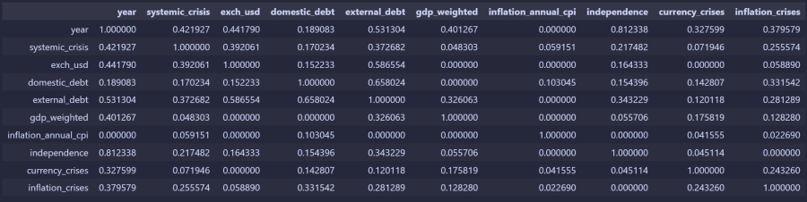

### Phi-K Correlation

**Phi K correlation** is a non-parametric measure of association that can be used with categorical data. It is similar to Pearson's correlation, but it does not require the assumption that the data is normally distributed.

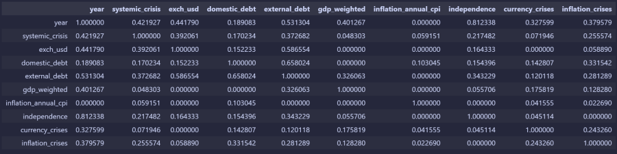

### Bivariate analyses

**Bivariate analyses** are statistical techniques that examine the relationship between two variables. They can be used to determine whether there is a significant association between two variables, and the strength of the association.

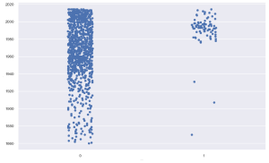 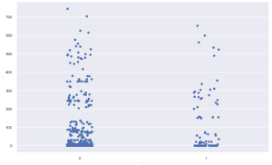 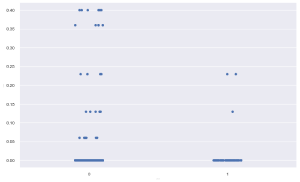 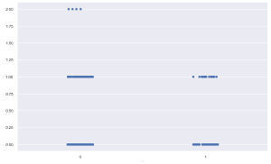

## Results

**Overfitting** -  is a phenomenon where a model learns the training data too well, resulting in poor performance on new data. This happens when the model learns the noise and irrelevant details in the training data, rather than the underlying patterns. As a result, the model is not able to generalize to new data that it has not seen before. So, we have to ignore methods that have extremely high score on Train Accuracy test (when it is more than 0.99).

### Classification Models

*Models comparison*

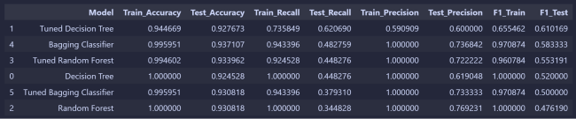

Based on F1 test, the best not overfitting method is **Tuned Decision Tree** scoring 0.61.

*Tuned Decision Tree feature importance*

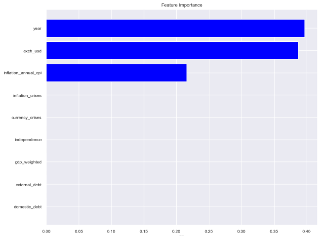

### Boosting Models

*Models comparison*

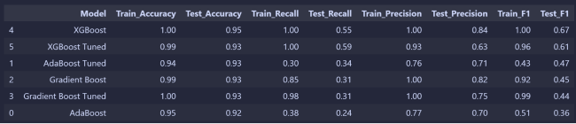

Based on F1 test, the best not overfitting method is **Tuned AdaBoost** scoring 0.47.

*Tuned Ada Boost feature importance*

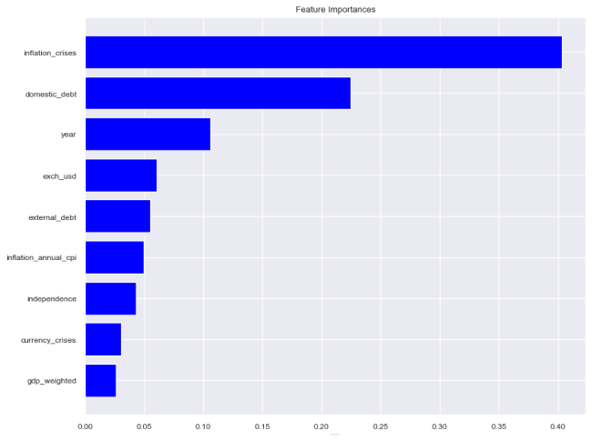

## Conclusion

On one hand false positive prediction could lead to panic among citizens, taking their money from the banks and only increasing the chances of crisis. On the other hand, false negative prediction leads to lack of preparation of people and companies with harsher crisis consequences for everyone. So, I want to make balanced model and **F1 test will be the most accurate in this case**.

If we ignore over fitting methods (that scored >0.99 on Train Accuracy test), **the best method for predicting crisis in this dataset is Tuned Decision Tree**, scoring 0.61 on F1 test.

*Tuned Decision Tree confusion matrix*

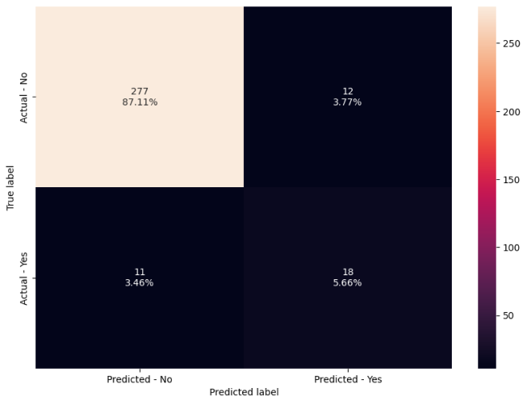

### Possible Improvements

While the tuned tree classifier was the best model in this study, there are still some areas that could be improved to make predictions even more accurate

* A **larger dataset** with more countries included would likely allow the model to learn more about the different factors that contribute to crises and would therefore improve its accuracy.
* Another area that could be improved is the . There are other features that could be used to improve the accuracy of the model. For example, features related to political stability or social unrest could be included in the model.
* **More classification methods** could also significantly benefit my result since, as we could see, even the best methods weren't using all of the features while some of them could have been correlating with the outcome in a more complicated way.

## References

* [https://scikit-learn.org/stable/index.html](https://scikit-learn.org/stable/index.html)
* [https://www.kaggle.com/datasets/chirin/africa-economic-banking-and-systemic-crisis-data](https://www.kaggle.com/datasets/chirin/africa-economic-banking-and-systemic-crisis-data)
* [https://spcs-programs.instructure.com](https://spcs-programs.instructure.com)
* [https://github.com/msNPS/ML-Crysis-Prediction](https://github.com/msNPS/ML-Crysis-Prediction)
